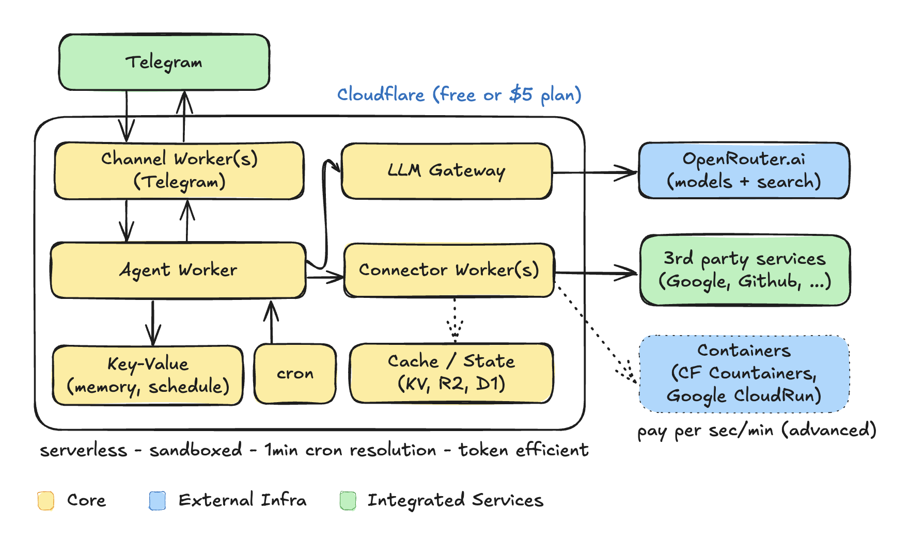

# SCAF — Serverless Cloud Agent Framework

A modular, provider-agnostic LLM framework with a terminal chat interface, a Cloudflare Worker agent with 3-tier memory and scheduling, and a Telegram bot — all powered by Bun and TypeScript.

## Architecture



SCAF runs entirely on Cloudflare's serverless platform (free or $5/mo plan). The architecture separates concerns across dedicated workers connected via service bindings:

- **Channel Workers** (e.g. Telegram) handle user-facing messaging and relay conversations to the Agent. Each channel is a thin relay with no LLM logic.
- **Agent Worker** is the central hub — it owns memory, system prompts, scheduling, tool calling, and dispatch. A cron trigger (1-minute resolution) drives the heartbeat scheduler.
- **LLM Gateway** is an internal-only passthrough to OpenRouter, providing access to Claude, OpenAI, and open models with web search. It holds the API key in isolation and forwards tool definitions/results transparently — the actual tool execution loop lives in the Agent.
- **Connector Workers** (e.g. Google) own OAuth2 tokens, API calls, and secrets for external services. The Agent invokes them as tools during LLM conversations.
- **Key-Value storage** backs agent memory (3-tier: working, summary, facts) and schedules, optimized for minimal reads per request.
- **Cache/State** (KV, R2, D1) is optional — connectors that need to persist or cache data (e.g. OAuth token caching) can bind their own storage.
- **Containers** (Cloudflare Containers, Google Cloud Run) are optional — an escape hatch for workloads that don't fit the Workers model. Most users won't need them.

Dotted borders in the diagram indicate optional components that may not be present in every deployment.

The design is serverless, sandboxed, and token-efficient. The cron heartbeat is a pure KV check — it only invokes the LLM (and consumes tokens) when a scheduled task actually fires. There is no periodic LLM-driven heartbeat. Users who want regular LLM-powered check-ins can create a recurring schedule (e.g. every 30 minutes) to achieve the same effect on their own terms.

## Features

- **CLI TUI** — Interactive terminal chat with real-time streaming, markdown rendering, and model switching
- **Agent Worker** — Cloudflare Worker that owns memory, system prompt, scheduling, tool calling, and dispatch
- **Google Connector** — Cloudflare Worker providing Gmail, Google Calendar, and Google Drive access via direct REST APIs
- **Tool calling** — LLM can invoke Google tools autonomously with a multi-round execution loop
- **LLM Gateway Worker** — Cloudflare Worker passthrough to OpenRouter (internal only, no public access)
- **Telegram Gateway Worker** — Telegram bot that relays messages through the Agent
- **Natural-language scheduling** — Create, list, update, and delete schedules through conversation
- **Provider-agnostic** — OpenRouter gives access to Claude, GPT-4o, Gemini, and more
- **Shared types** — Common interfaces in `@scaf/shared` used across all components

## Project Structure

```text
src/                          CLI TUI
  app.tsx                     Root chat component
  components/                 Ink UI components
  llm/                        LLM client (agent or direct)
  secrets/                    ~/.scaf/secrets.json management

packages/shared/              Shared types (@scaf/shared)

workers/
  agent/                      Cloudflare Worker — Agent (memory, prompts, scheduling, dispatch)
    src/memory/               3-tier memory system (KV-backed)
    src/schedule/             Schedule store, heartbeat, dispatch, extraction, context injection
    src/tools/                Tool definitions and execution (Google tools)
    src/prompts/              System prompt
  llm-gateway/                Cloudflare Worker — LLM passthrough to OpenRouter (internal only)
  telegram-gateway/           Cloudflare Worker — Telegram bot
  connectors/google/          Cloudflare Worker — Google Connector (Gmail, Calendar, Drive)
```

## Prerequisites

- [Bun](https://bun.sh) (v1.0+)
- [Wrangler](https://developers.cloudflare.com/workers/wrangler/) (for deploying Workers)
- An [OpenRouter](https://openrouter.ai) API key
- A Telegram bot token from [@BotFather](https://t.me/BotFather) (for the Telegram gateway)
- A Google Cloud project with Gmail, Calendar, and Drive APIs enabled (for the Google Connector)

## Quick Start

```bash
# Install dependencies
bun install

# Run the CLI
bun run start
```

On first launch, the setup wizard prompts you to choose a connection mode:

1. **Agent Worker** — enter the URL and token of your deployed Agent worker
2. **Direct OpenRouter** — enter your OpenRouter API key directly

Secrets are stored at `~/.scaf/secrets.json` (file permissions 0600).

## Scripts

```bash
# CLI
bun run start              # Launch the CLI TUI
bun run dev                # Launch with --watch for development
bun test                   # Run tests

# Workers — local development
bun run dev:agent          # Run Agent worker locally (wrangler dev)
bun run dev:gateway        # Run LLM gateway locally (wrangler dev)
bun run dev:telegram       # Run Telegram gateway locally (wrangler dev)
bun run dev:google         # Run Google Connector locally (wrangler dev)

# Workers — deploy to Cloudflare
bun run deploy             # Deploy all workers
bun run deploy:agent       # Deploy Agent worker only
bun run deploy:gateway     # Deploy LLM gateway only
bun run deploy:telegram    # Deploy Telegram gateway only
bun run deploy:google      # Deploy Google Connector only

# Google OAuth
bun run google-auth        # Run OAuth2 browser flow to authorize Google access
```

## CLI Commands

| Command | Description |
|---|---|
| `/model` | List available models |
| `/model <alias or id>` | Switch model (e.g. `/model sonnet`, `/model openai/gpt-4o`) |
| `/clear` | Clear conversation history |
| `/quit` or `/exit` | Exit |

**Model aliases:** `haiku`, `sonnet`, `opus`, `gpt4o`, `gpt4o-mini`, `gemini-flash`, `gemini-pro`

## Setup

### Quick setup (recommended)

```bash
bun install
cp .env.example .env    # fill in your API keys
bun run setup
```

The setup wizard detects existing state and only performs what's missing:

- Prompts for any secrets not yet in `.env`
- Creates KV namespaces (AGENT_KV and TOOL_CACHE, or reuses existing)
- Deploys all four workers
- Pushes secrets to Cloudflare (only missing ones)
- Registers the Telegram webhook

Re-run `bun run setup` at any time — it's incremental and safe to repeat. Use `bun run setup --force` to redo everything.

### Teardown

### Google Connector setup

The Google Connector requires a one-time OAuth2 authorization:

1. Create a Google Cloud project and enable **Gmail API**, **Google Calendar API**, and **Google Drive API**
2. Create an OAuth 2.0 Client ID (Desktop app type) and set `GOOGLE_CLIENT_ID` and `GOOGLE_CLIENT_SECRET` in `.env`
3. Run the OAuth flow:

```bash
bun run google-auth
```

This opens a browser for Google consent, exchanges the authorization code for a refresh token, and saves `GOOGLE_REFRESH_TOKEN` to `.env`. Works for both consumer (gmail.com) and Google Workspace accounts.

4. Run `bun run setup` to push the secrets to Cloudflare

### Teardown

To remove all deployed workers, KV namespaces, and the Telegram webhook:

```bash
bun run undeploy
```

Your `.env` is preserved so you can re-run `bun run setup` to redeploy.

### Manual setup

See each worker's `wrangler.jsonc` for required secrets and bindings. Secrets can be set individually with `wrangler secret put`.

## Worker Architecture

### Agent Worker

The Agent is the central worker. It owns memory, system prompt injection, scheduling, and dispatch. It has a cron trigger (every minute) for the heartbeat scheduler.

**Routes:**

- `POST /v1/complete` — non-streaming completion (with memory + system prompt)
- `POST /v1/stream` — streaming completion (SSE)
- `POST /v1/dispatch` — execute a schedule entry (prompt or action)
- `GET/POST/PUT/DELETE /v1/schedules[/:id]` — schedule CRUD

### 3-Tier Memory

The Agent automatically manages conversation memory via Cloudflare KV (`AGENT_KV`):

| Tier | What it stores | TTL |
|---|---|---|
| **Working** | Last 20 message pairs | 1 day |
| **Summary** | Compressed conversation history | 30 days |
| **Facts** | Extracted user preferences and info | 90 days |

Memory is injected into the system prompt and updated in the background after each response.

### Google Connector

The Google Connector (`workers/connectors/google/`) is a dedicated Cloudflare Worker that owns OAuth2 tokens and all Google API interactions. The Agent calls it via service binding — no public HTTP access.

**Gmail tools:** `gmail_search`, `gmail_read`, `gmail_send`, `gmail_draft`, `gmail_unread`
**Calendar tools:** `calendar_list`, `calendar_get`, `calendar_create`, `calendar_update`
**Drive tools:** `drive_list`, `drive_search`, `drive_get`, `drive_download`

OAuth2 access tokens are cached in the `TOOL_CACHE` KV namespace with a 55-minute TTL and automatically refreshed using the stored refresh token.

### Tool Calling

The Agent injects Google tool definitions into LLM requests using the OpenAI function-calling format. When the LLM responds with `tool_calls`, the Agent executes them against the Google Connector, feeds results back, and loops until the LLM produces a final text response (up to 5 rounds). Tool calling works in both interactive conversations and scheduled task dispatch.

### LLM Gateway

The LLM Gateway is a passthrough to OpenRouter. It holds the API key, passes through tool definitions and tool call results, and is only accessible via service binding from the Agent — no public HTTP access.

### Telegram Gateway

**Bot commands:**

- `/start` — Welcome message
- `/help` — List commands
- `/model <name>` — Switch model for this chat
- `/reset` — Clear conversation history

## Scheduling

The Agent enables time-based task execution through natural language. Users create, list, update, and delete schedules by chatting with the assistant (via Telegram or CLI). The Agent extracts scheduling commands from the LLM response and stores them in KV. A cron trigger (every minute) runs the heartbeat dispatcher.

### How It Works

1. **User** asks to schedule something via natural language
2. **Agent** injects the current datetime and user timezone into the system prompt
3. **LLM** responds with a confirmation and embeds a `<schedule_command>` block
4. **Agent** strips the command block from the response, parses it, and stores the entry in `AGENT_KV`
5. **Agent cron** (every minute) reads all entries from KV, finds those where `nextRun <= now`, and dispatches them
6. For **prompt** mode entries: runs the prompt through the full Agent pipeline (memory + LLM + tool calling), then sends the response to Telegram with a confirmation of any actions taken
7. For **action** mode entries: executes inline (send a fixed Telegram message or make an HTTP request) and confirms completion via Telegram
8. **Recurring** entries get their `nextRun` recomputed from the cron expression; **one-shot** entries are deleted after firing

### Schedule Types

| Type | Description |
|---|---|
| **Recurring** | Fires on a cron pattern. `nextRun` is recomputed after each firing. |
| **One-shot** | Fires once at a specific time, then self-deletes. Past-due one-shots are retried on the next heartbeat tick. |

### Execution Modes

| Mode | Description | Cost |
|---|---|---|
| **prompt** | Sends the prompt to the LLM for a full reasoning response, then delivers to Telegram. | LLM tokens + Worker CPU |
| **action** | Executes a fixed operation inline (send message, HTTP request) without touching the LLM. | ~1ms Worker CPU only |

### Run Tracking

Every schedule entry tracks:

| Field | Description |
|---|---|
| `maxRuns` | Maximum number of times this entry should fire. Omit for unlimited (`*`). |
| `runCount` | Total number of times this entry has fired so far. |
| `successCount` | Number of runs that completed successfully. |
| `failureCount` | Number of runs that failed (LLM error, HTTP error, etc.). |
| `lastRun` | Timestamp of the most recent run. |
| `lastRunStatus` | `"success"` or `"failure"` for the most recent run. |

When a recurring entry reaches its `maxRuns` limit, it is automatically deleted.

### Scheduling Examples

- **Daily at 9am**: "Remind me to review my inbox every morning at 9am" — recurring, cron `0 9 * * *`
- **Yearly date**: "Wish me happy birthday every July 15 at 9am" — recurring, cron `0 9 15 7 *`
- **Weekly**: "Give me a weekly summary every Monday at noon" — recurring, cron `0 12 * * 1`
- **One-shot**: "Remind me to call the dentist tomorrow at 4pm" — one-shot with computed `nextRunIso`
- **Relative delay**: "Remind me to stretch in 2 hours" — one-shot, current time + 2 hours
- **Limited runs**: "Remind me to take medication every morning at 8am for 7 days" — recurring with `maxRuns: 7`

### Managing Schedules via Natural Language

- **List**: "What are my scheduled tasks?"
- **Update**: "Change my morning reminder to 8am instead of 9am"
- **Delete**: "Cancel the water reminder"

### Schedule REST API

| Method | Endpoint | Description |
|---|---|---|
| `GET` | `/v1/schedules` | List all schedule entries |
| `GET` | `/v1/schedules/:id` | Get a single entry by ID |
| `POST` | `/v1/schedules` | Create a new entry |
| `PUT` | `/v1/schedules/:id` | Update an existing entry |
| `DELETE` | `/v1/schedules/:id` | Delete an entry |

### Timing Accuracy

The Agent heartbeat runs every minute. Scheduled events fire on the first heartbeat tick after their `nextRun` time, so they may be up to ~60 seconds late but are never missed.

## How SCAF Compares

The personal AI agent space took off in late 2025 with the rise of OpenClaw and its alternatives. SCAF takes a fundamentally different approach: **serverless-native, zero-maintenance infrastructure** instead of self-hosted daemons or containers.

### At a Glance

| Dimension | OpenClaw | NanoClaw | ZeroClaw | **SCAF** |
|---|---|---|---|---|
| **Language** | TypeScript / Node.js | Node.js + Claude Agent SDK | Rust | **TypeScript / Bun** |
| **Runtime** | Node.js process | Docker containers | Single binary daemon | **Cloudflare Workers (serverless)** |
| **Hosting** | Self-hosted server | Self-hosted + Docker | Self-hosted daemon | **Cloudflare free or $5/mo plan** |
| **Always-on cost** | Yes (VPS $5–20/mo) | Yes (VPS + Docker) | Yes (any hardware) | **No — pay nothing when idle** |
| **Cold start** | Seconds | Seconds | <10 ms | **~50 ms (CF Workers)** |
| **RAM usage** | 1 GB+ | ~200 MB | <5 MB | **0 (serverless, no process)** |
| **Binary / install size** | Large (npm tree) | Medium (Docker image) | ~8.8 MB | **N/A — deployed to Cloudflare** |
| **Channels** | 20+ (WhatsApp, Slack, Discord, …) | WhatsApp + extensible | CLI + Discord | Telegram + CLI |
| **LLM providers** | Multi-provider | Claude only | Multi-provider | **Multi-provider (via OpenRouter)** |
| **Memory** | Persistent | Persistent | SQLite + vector search | **3-tier KV (working / summary / facts)** |
| **Scheduling** | Basic | Basic | Unknown | **Full cron + natural language + active hours** |
| **Tool calling** | Skills system | Agent swarms | Extensible | **Multi-round loop with service-bound connectors** |
| **Codebase** | 100K+ lines | ~3,900 lines | Unknown | **~3,000 lines** |
| **Security model** | Permission-based | Container isolation | OS-level + allowlists | **CF Worker isolation + service bindings** |

### Why SCAF

**Zero maintenance.** OpenClaw users report 8–20 hours of initial setup and 2–4 hours of monthly maintenance — daemon crashes, Node.js version conflicts, plugin breakage, update regressions. NanoClaw requires Docker expertise. ZeroClaw runs as a daemon with 261 `.unwrap()` calls that can panic and crash the runtime. SCAF deploys with `bun run setup` and runs on Cloudflare's managed infrastructure. There is no daemon to crash, no server to SSH into at 2am, no Docker to configure.

**No idle cost.** Every alternative requires an always-on process. SCAF Workers spin up on request and die after execution. The cron heartbeat is a KV read — it only invokes the LLM when a scheduled task actually fires.

**Isolated by default.** API keys, OAuth tokens, and service credentials never share a runtime. The LLM Gateway holds the OpenRouter key. The Google Connector holds OAuth tokens. The Agent orchestrates via service bindings — internal RPC with no network hops and no public HTTP surface.

**Scheduling that works.** SCAF's scheduling is purpose-built: cron expressions, one-shot timers, natural language creation, active hours, run limits, and run tracking — all backed by platform-level cron triggers with 1-minute resolution. No timing drift from in-process timers.

### vs. OpenClaw

OpenClaw has the broadest feature set (20+ messaging channels, voice, skills marketplace) and the largest community (247K stars). If you need WhatsApp, Slack, Discord, and iMessage support today, OpenClaw is the pragmatic choice. But the operational burden is significant: major updates regularly break working configurations (v2026.3.22 broke Dashboard UI and WhatsApp with 12 breaking changes), plugins cause gateway unresponsiveness, and Reddit threads describe it as "not even remotely close to production use." SCAF trades channel breadth for reliability and zero ops.

### vs. NanoClaw

NanoClaw's container isolation model is excellent for security — every agent session gets its own Linux container with isolated filesystem and process space. It also supports agent swarms (multiple Claude instances collaborating in parallel). However, it's locked to Claude as the LLM provider, requires Docker infrastructure, and still needs a running server. SCAF is provider-agnostic via OpenRouter and requires no server or container runtime at all.

### vs. ZeroClaw

ZeroClaw's Rust implementation is impressively lightweight (~8.8 MB binary, <5 MB RAM, <10 ms cold start) and targets edge/embedded hardware. Its AIEOS spec for portable agent personas is a novel idea. However, it runs as a system daemon with crash risks from unhandled errors, and its scheduling capabilities are limited. SCAF can't match ZeroClaw's raw performance on constrained hardware, but it eliminates hardware requirements entirely — there is nothing to run.

### vs. Moltworker

Moltworker is Cloudflare's official serverless OpenClaw port — the closest architectural sibling to SCAF. However, it's explicitly "experimental" and "may break without notice." It's a port of a monolithic codebase onto Workers, not a native serverless design. SCAF was built for Workers from the ground up, with service bindings, KV-backed memory, and cron-triggered scheduling as first-class primitives.

### Tradeoffs

SCAF is not the right choice for every use case:

- **Channel breadth**: OpenClaw supports 20+ messaging platforms. SCAF currently supports Telegram and CLI.
- **Worker limits**: Cloudflare Workers have CPU time limits (10–30 ms on free plan, 30 s on paid), memory caps, and request size constraints. Complex multi-tool chains may hit these limits.
- **Vendor coupling**: SCAF runs on Cloudflare. Moving to another platform would require rearchitecting the worker and service binding model.
- **Community**: OpenClaw has 247K stars and a large ecosystem. SCAF is a solo project.
- **Voice**: OpenClaw has voice wake and talk modes. SCAF has no voice support.
- **Agent swarms**: NanoClaw can run multiple Claude instances collaborating in parallel. SCAF runs a single agent.

## Tech Stack

| Layer | Technology |
|---|---|
| Runtime | Bun + TypeScript |
| CLI TUI | React 19 + Ink 6 |
| Markdown | marked v15 + marked-terminal |
| Telegram bot | grammY |
| Serverless | Cloudflare Workers + KV |
| LLM API | OpenRouter (OpenAI-compatible) |
| Google APIs | Direct REST (Gmail, Calendar, Drive) — no SDK |

## Architecture Decisions

- **No SDK** — raw `fetch()` to OpenRouter; no OpenAI SDK dependency
- **Bun-first** — uses Bun for runtime, testing, and package management
- **Agent as central hub** — the Agent owns memory, prompts, scheduling, tool calling, and dispatch; the LLM Gateway is a dumb passthrough
- **Connector pattern** — external service integrations are isolated in dedicated Workers (e.g. Google Connector), connected via service bindings
- **LLM Gateway isolation** — the OpenRouter API key is isolated to the LLM Gateway, accessible only via service binding
- **Google Connector isolation** — OAuth2 tokens and Google API calls are isolated to the Google Connector Worker with its own KV (TOOL_CACHE)
- **Two KV namespaces** — AGENT_KV for memory (`memory:*`) and schedules (`schedule:*`); TOOL_CACHE for OAuth2 token caching
- **Memory as system prompt** — memory tiers are injected into the system prompt, not duplicated as messages
- **Background processing** — memory extraction and summarization run via `waitUntil()` and never block responses
- **Thin relay pattern** — the Telegram gateway contains no LLM logic; it delegates everything to the Agent
- **Scheduling via conversation** — the LLM emits structured `<schedule_command>` blocks; the Agent extracts and processes them transparently
- **Tool execution loop** — LLM can invoke tools autonomously across multiple rounds; tool calls are routed to connectors via service bindings
- **Heartbeat dispatcher** — pure KV read + dispatch; LLM reasoning and tool calling only happen at dispatch time for prompt-mode entries; past-due entries are never missed
